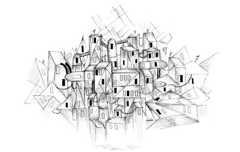

# Higher-order Functions

> كان Tzu-li و Tzu-ssu يتفاخران بحجم برامجهما الأخيرة. قال تزو لي: "مائتي ألف سطر" ، "دون احتساب التعليقات!" أجاب تزو-سسو ، "Pssh ، ما يقرب من مليون سطر بالفعل." قال السيد يوان-ما ، "أفضل برنامج لدي به خمسمائة سطر عند سماع ذلك ، تم تنوير تزوي-لي وتسو-سو.
>
> ماجستير يوان ما ، كتاب البرمجة

> هناك طريقتان لبناء تصميم البرنامج: إحدى الطرق هي جعله بسيطًا جدًا بحيث لا توجد عيوب بوضوح ، والطريقة الأخرى هي جعله معقدًا للغاية بحيث لا توجد عيوب واضحة  
>
>                                                    سيارة. هواري ، 1980 محاضرة عن جائزة إيه سي إم تورينج



يعد البرنامج الكبير مكلفًا ، وهذا ليس فقط بسبب الوقت الطويل الذي يستغرقه إنشائه ، ولكن أيضًا تعقيد البرنامج دائمًا ما يكون جزءًا من الحجم ؛ شيء يربك المبرمجين ويحيرهم ويسبب أخطاء في البرنامج. لذا فإن البرنامج الكبير يوفر مساحة كبيرة لإخفاء الأخطاء ويجعل من الصعب العثور على الأخطاء.

دعونا نلقي نظرة سريعة على النسخة النهائية من البرنامجين التمهيديين للكتاب. البرنامج الأول ليس له وظيفة ولديه ستة أسطر من التعليمات البرمجية في المجموع:

```text
let total = 0, count = 1;
while (count <= 10) {
  total += count;
  count += 1;
}
console.log(total);
```

البرنامج الثاني يستخدم وظيفتين ويحتوي على سطر واحد فقط:

```text
console.log(sum(range(1, 10)));
```

أيهما أكثر عرضة للإصابة بالخلل؟

إذا أخذنا في الاعتبار حجم تعريف دوال الجمع'sum' والمدى'range' ، فإن البرنامج الثاني هو أيضًا برنامج كبير - حتى أكبر من البرنامج الأول. لكن ما زلت أدعي أن هذا البرنامج سيعمل على الأرجح بشكل صحيح.

ممن المرجح أن تكون صحيحة لأن الحل يتم التعبير عنه في مفردات تتوافق مع المشكلة التي يتم حلها.جمع نطاق من الأرقام لا يتعلق بالحلقات والعدادات. يتعلق بالفترات الزمنية والعمل

تعريفات هذه المفردات \( functions `sum`  و `range`\)ستظل تتضمن الحلقات والعدادات والتفاصيل العرضية الأخرى.ولكن نظرًا لأنها تعبر عن مفاهيم أبسط من البرنامج ككل ، فمن الأسهل فهمها بشكل صحيح.

### Abstraction

في فضاء البرمجة ، يشار إلى هذه الكلمات عمومًا على أنها مجردة  _abstractions_ تخفي التجريدات التفاصيل وتسمح لنا بالحديث عن المشكلات على مستوى أعلى \(مزيد من التجريد\).

كاستعارة ، يمكن مقارنة طريقتين لصنع حساء البازلاء. الحالة الأولى ستكون على النحو التالي:

> صب كوبًا واحدًا من البازلاء المجففة في وعاء واحد لكل شخص. أضف الماء لتغطية كل البازلاء. دع البازلاء تنقع لمدة 12 ساعة على الأقل. ثم أخرج البازلاء من الماء وضعها في وعاء. أضف 4 أكواب من الماء لكل شخص. غطي الوعاء واتركيه على الغاز لمدة ساعتين. لكل شخص ، نأخذ نصف بصلة ونقطعها ونضيفها إلى البازلاء. خذ ساق كرفس واحد لكل شخص. قطعيها بسكين وأضيفيها إلى البازلاء. لكل شخص يعتبر جزرة مقطعة بسكين! ويضاف الى البازلاء. دع الطهي لمدة 10 دقائق أخرى

**طريقة التحضير الثانية:**

> لكل: كوب من البازلاء المجففة ونصف بصلة مقطعة وساق كرفس وجزرة.
>
> نقع البازلاء لمدة 12 ساعة. يغلي لمدة ساعتين في 4 أكواب من الماء \(لشخص واحد\) على غاز بطيء. نقطع الخضار ونضيفها. طهي لمدة 10 دقائق أخرى

الأمر الثاني كان أقصر وأسهل في الشرح. لكن لفهم ذلك ، عليك أن تتذكر بعض الكلمات المتعلقة بالطهي - النقع ، والغليان ، والتقطيع ، وأعتقد أن الخضار

عند البرمجة ، لا يمكننا أن نفترض أن كل الكلمات التي نحتاجها موجودة وتنتظرنا في القاموس. وبالتالي ، قد نقع في فخ النمط في الإعداد الأول - العمل على الخطوات الدقيقة التي يجب أن يقوم بها الكمبيوتر ، واحدة تلو الأخرى ، بغض النظر عن مفاهيم المستوى الأعلى التي تنقلها هذه الأوامر.

من المهارات العملية في البرمجة أن تكون مدركًا لها عندما تعمل بمستوى منخفض جدًا من التجريد.

### Abstracting repetition

الوظائف البسيطة ، مثل تلك التي رأيناها حتى الآن ، مفيدة لإنشاء التجريد. لكن في بعض الأحيان لا تكون كافية.

من الشائع في البرامج تكرار عدد معين من المهام. يمكنك استخدام حلقة for للقيام بذلك:

```text
for (let i = 0; i < 10; i++) {
  console.log(i);
}
```

هل من الممكن فصل "عدد مرات أداء مهمة" باستخدام دالة؟ حسنًا ، من السهل جدًا كتابة دالة تستدعي console.log N مرات.

```text
function repeatLog(n) {
  for (let i = 0; i < n; i++) {
    console.log(i);
  }
}
```

ولكن ماذا لو أردنا القيام بشيء آخر غير طباعة الأرقام في المخرجات؟ نظرًا لأن "القيام بمهمة" يمكن اعتباره دالة ، والوظائف هي قيم فعلية ، يمكننا إرسال "المهمة" كقيمة دالة.

```text
function repeat(n, action) {
  for (let i = 0; i < n; i++) {
    action(i);
  }
}

repeat(3, console.log);
// → 0
// → 1
// → 2
```

لا تحتاج إلى إرسال وظيفة محددة مسبقًا إلى وظيفة التكرار' `repeat` '. غالبًا ما يكون من الأسهل إنشاء "قيمة دالة" في نفس الوقت.

```text
let labels = [];
repeat(5, i => {
  labels.push(`Unit ${i + 1}`);
});
console.log(labels);
// → ["Unit 1", "Unit 2", "Unit 3", "Unit 4", "Unit 5"]
```

تشبه هذه البنية إلى حد ما حلقة for - فهي تحدد أولاً نوع الحلقة ثم توفر الجسم. ومع ذلك ، فإن الجسم مكتوب الآن كقيمة دالة ، وهو نفسه محاط بأقواس لاستدعاء وظيفة التكرار.هذا هو السبب في أنه يجب إغلاقه بقوس إغلاق وقوس إغلاق.في مثل هذه الحالات ، حيث يكون الجسم عبارة عن تعبير واحد صغير ، يمكنك إزالة الأقواس وكتابة الحلقة في سطر واحد.

تسمح لنا وظائف المستوى الأعلى بإنشاء تجريدات تستند إلى الإجراءات ، وليس القيم فقط. تأتي هذه الوظائف في أشكال عديدة. على سبيل المثال ، يمكن أن يكون لديك وظائف تنشئ وظائف بنفسها.

```text
function greaterThan(n) {
  return m => m > n;
}
let greaterThan10 = greaterThan(10);
console.log(greaterThan10(11));
// → true
```

ويمكن أن يكون لدينا دوال تغير دوال أخرى.

```text
function noisy(f) {
  return (...args) => {
    console.log("calling with", args);
    let result = f(...args);
    console.log("called with", args, ", returned", result);
    return result;
  };
}
noisy(Math.min)(3, 2, 1);
// → calling with [3, 2, 1]
// → called with [3, 2, 1] , returned 1
```

يمكنك حتى كتابة وظائف توفر نوعًا جديدًا من تدفق التحكم.

```text
function unless(test, then) {
  if (!test) then();
}

repeat(3, n => {
  unless(n % 2 == 1, () => {
    console.log(n, "is even");
  });
});
// → 0 is even
// → 2 is even
```

هناك طريقة محددة مسبقًا للمصفوفات تسمى forEach تقوم بشيء مثل حلقة for / of كدالة عالية الجودة.

```text
["A", "B"].forEach(l => console.log(l));
// → A
// → B
```

### Script data set

تعد معالجة البيانات من الأماكن التي تتألق فيها الوظائف المتطورة. لمعالجة البيانات ، نحتاج إلى بيانات حقيقية, سيستخدم هذا الفصل مجموعة بيانات حول النصوص — أنظمة الكتابة مثل اللاتينية أو السيريلية أو العربية.

استرجع Unicode من الفصل 1 ، وهو نظام يقوم بتعيين رقم لكل حرف في اللغة المكتوبة. تنتمي معظم هذه الأحرف إلى أبجدية معينة. يحتوي هذا المعيار على 140 حرفًا مختلفًا - من بينها ، 81 قيد الاستخدام اليوم و 59 قديمة.

على الرغم من أنني لا أستطيع قراءة الأحرف اللاتينية إلا بطلاقة ، إلا أنني معجب بحقيقة أن الناس حول العالم يكتبون في ما لا يقل عن 80 نظام كتابة آخر ، لا يمكنني حتى التعرف على الكثير منها. على سبيل المثال ، ما يلي مثال مكتوب بخط اليد من التاميل:


تحتوي قاعدة البيانات النموذجية الخاصة بنا على معلومات حول حوالي 140 حرفًا أبجديًا في Unicode. يمكن تنزيل هذه البيانات في قسم   [coding sandbox](https://eloquentjavascript.net/code#5)  في هذا الفصل كمتغير SCRIPTS. يحتوي هذا المتغير على مجموعة من الكائنات ، كل منها يمثل أبجدية.

> ```text
> {
>   name: "Coptic",
>   ranges: [[994, 1008], [11392, 11508], [11513, 11520]],
>   direction: "ltr",
>   year: -200,
>   living: false,
>   link: "https://en.wikipedia.org/wiki/Coptic_alphabet"
> }
> ```

تتضمن هذه الكائنات اسم الأبجدية ونطاق Unicode المخصص لها والاتجاه الذي تمت كتابته فيه والأصل الزمني \(التقريبي\) وما إذا كان لا يزال قيد الاستخدام ورابطًا لمزيد من المعلومات. لكتابتها يمكن أن تكون "ltr" من اليسار إلى اليمين ، أو "rtl" من اليمين إلى اليسار \(مثل العربية والعبرية\) أو "ttb" من الأعلى إلى الأسفل \(مثل المنغولية\).

تحتوي خاصية النطاقات"ranges" على مصفوفة من نطاقات أحرف Unicode ، كل منها عبارة عن صفيف مكون من عنصرين بحد أدنى وأعلى. كل رمز حرف في هذا النطاق ينتمي إلى الأبجدية. يكون الحد الأدنى شاملاً \(الرمز 994 هو حرف قبطي\) ، والحد الأعلى غير شامل \(الرمز 1008 ليس كذلك\)

### Filtering arrays

يمكن أن تكون الوظيفة التالية مفيدة للعثور على الحروف الأبجدية التي لا تزال قيد الاستخدام. تعمل هذه الوظيفة كمرشح ولا تتضمن عناصر لا تتوافق مع الشرط.

```text
function filter(array, test) {
  let passed = [];
  for (let element of array) {
    if (test(element)) {
      passed.push(element);
    }
  }
  return passed;
}

console.log(filter(SCRIPTS, script => script.living));
// → [{name: "Adlam", …}, …]
```

تستخدم الوظيفة الوسيطة المسماة test ، وهي قيمة دالة ، لملء "فجوة" في الحساب اولاكمال الحساب - فعل عملية تحديد العناصر التي يجب جمعها.

لاحظ كيف أن وظيفة التصفية 'filter '، بدلاً من إزالة العناصر من المصفوفة ، تنشئ مصفوفة جديدة تحتوي فقط على العناصر التي تطابق الشرط ، هذه وظيفة نقيه "pure". لاتغير الصفيف المعطى .


مثل forEach ، وظيفة التصفية هي طريقة مصفوفة قياسية. في المثال أعلاه ، تم تعريف الوظيفة لإظهار كيفية عملها. من الآن فصاعدًا ، سوف نستخدمه على النحو التالي

مثل forEach و filter هي طريقة مصفوفة قياسية,  في المثال أعلاه ، تم تعريف الوظيفة لإظهار كيفية عملها داخليا . من الآن فصاعدًا ، سوف نستخدمه على النحو التالي:

```text
console.log(SCRIPTS.filter(s => s.direction == "ttb"));
// → [{name: "Mongolian", …}, …]
```

### Transforming with map <a id="map"></a>

لنفترض أن لدينا مجموعة من الكائنات التي تمثل الأبجدية التي تم إنشاؤها بعد تطبيق المرشح على مجموعة SCRIPTS. ولكن إذا كان لدينا مجموعة من الأسماء ، فستكون مهمتنا أسهل.

يتم استخدام طريقة الخريطة"map" لتعديل مصفوفة. من خلال تطبيق دالة على جميع عناصر المصفوفة وإنشاء مصفوفة جديدة من القيم المرجعة. عدد العناصر في المصفوفة الجديدة يساوي مصفوفة الإدخال. لكن محتواه يتغير من خلال الوظيفة المحددة.

```text
function map(array, transform) {
  let mapped = [];
  for (let element of array) {
    mapped.push(transform(element));
  }
  return mapped;
}

let rtlScripts = SCRIPTS.filter(s => s.direction == "rtl");
console.log(map(rtlScripts, s => s.name));
// → ["Adlam", "Arabic", "Imperial Aramaic", …]
```

على غرار forEach و filter ، فإن طريقة map هي أيضًا طريقة مصفوفة قياسية.

### Summarizing with \(reduce\)تلخيص المصفوفة بالطريقة

هناك مهمة أخرى شائعة يتم إجراؤها باستخدام المصفوفات وهي حساب قيمة واحدة منها. مثالنا المكرر هو إضافة مجموعة من الأرقام. مثال آخر يمكن أن يكون العثور على البرنامج النصي  التي تحتوي على أكبر عدد من الأحرف.

تسمى العملية ذات الترتيب الأعلى التي تمثل هذا النمط \(reduce\) تسمى احيانا fold . تأخذ هذه الطريقة عنصرًا من المصفوفة بشكل متكرر وتدمجها مع القيمة الحاليه ، مما ينتج عنه في النهاية قيمة واحدة. عند جمع الأرقام ، تبدأ بصفر ثم تضيف العناصر واحدًا تلو الآخر.

المعلمات  "reduce"، بصرف النظر عن المصفوفة,  تحتوي على دالة مركبة وقيمة أولية. هذه الوظيفة أقل وضوحًا من وظيفة filter و map ، لذا ألق نظرة فاحصة عليها:

```text
function reduce(array, combine, start) {
  let current = start;
  for (let element of array) {
    current = combine(current, element);
  }
  return current;
}

console.log(reduce([1, 2, 3, 4], (a, b) => a + b, 0));
// → 10
```

تتميز طريقة reduceالمصفوفة القياسية ، والتي تشبه الوظيفة المذكورة أعلاه ، بميزة إضافية. إذا كانت المصفوفة الخاصة بك تحتوي على عنصر واحد على الأقل ، يمكنك حذف وسيطة start. تعتبر الوظيفة نفسها العنصر الأول من المصفوفة كقيمة بداية وتبدأ عملية الاختزال من العنصر الثاني.

```text
console.log([1, 2, 3, 4].reduce((a, b) => a + b));
// → 10
```

لاستخدام طريقة الاختزال \(مرتين\) للعثور على الأبجدية التي تحتوي على أكبر عدد من الأحرف ، يمكننا كتابة شيء مثل الرمز أدناه:

```text
function characterCount(script) {
  return script.ranges.reduce((count, [from, to]) => {
    return count + (to - from);
  }, 0);
}

console.log(SCRIPTS.reduce((a, b) => {
  return characterCount(a) < characterCount(b) ? b : a;
}));
// → {name: "Han", …}
```

تقلل وظيفة characterCount الفواصل الزمنية المرتبطة بالأبجدية عن طريق جمعها. لاحظ استخدام "التدمير" في قائمة المعلمات في دالة الاختزال. في الاستدعاء الثاني لوظيفة الاختزال ، تُستخدم هذه النتيجة للعثور على أكبر أبجدية ؛ يقارن الأبجدية زوجًا من الزوج ويعيد الأبجدية الأكبر.

تحتوي أبجدية Hanعلى أكثر من 89000 حرف في معيار Unicode ، مما يجعلها أكبر نظام كتابة في المجموعة. Han هي الأبجدية المستخدمة \(أحيانًا\) للنصوص الصينية واليابانية والكورية. هذه اللغات لها العديد من الشخصيات المشتركة ، على الرغم من اختلاف كتابتها. قرر اتحاد Unicode Consortium \(ومقره الولايات المتحدة\) اعتبارها نظام كتابة واحد لاستخدام رمز أقل للحروف. هذا ما يسمى بتوحيد أبجدية Han ، والتي لا تزال تثير غضب بعض الناس.


### Composability الدمج 

فكر في كيفية كتابة المثال السابق \(إيجاد أكبر أبجدية\) دون استخدام وظيفة المستوى الأعلى. لم تعمل بشكل سيء 

```text
let biggest = null;
for (let script of SCRIPTS) {
  if (biggest == null ||
      characterCount(biggest) < characterCount(script)) {
    biggest = script;
  }
}
console.log(biggest);
// → {name: "Han", …}
```

هناك عدد قليل من الارتباطات ، والبرنامج أطول بأربعة أسطر. لكنها لا تزال سهلة القراءة.

تبدأ الوظائف المتطورة في التوهج عندما تحتاج إلى دمج العمليات. على سبيل المثال ، دعنا نكتب رمزًا يعثر على متوسط ​​سنة الإنشاء للأبجديات الحية والقديمة.

```text
function average(array) {
  return array.reduce((a, b) => a + b) / array.length;
}

console.log(Math.round(average(
  SCRIPTS.filter(s => s.living).map(s => s.year))));
// → 1188
console.log(Math.round(average(
  SCRIPTS.filter(s => !s.living).map(s => s.year))));
// → 188
```

لذلك ، في المتوسط ​​، الحروف الهجائية المتقادمة في Unicode أقدم من الأبجدية الحية. هذه النتيجة لا تعني الكثير أو أنها ليست إحصائية مفاجئة. لكن أرجو أن تتفق معي في أن الكود المستخدم لحساب هذه النتيجة مقروء. يمكنك التفكير في الأمر كخط أنابيب: نبدأ بكل الحروف الأبجدية ، ونقوم بتصفية العناصر الحية \(أو القديمة\) ، ونستغرق سنوات منها ، ونقوم بتوسيط النتيجة وتقريبها.

يمكن بالتأكيد تنفيذ هذا الحساب بواسطة حلقة كبيرة.

```text
let total = 0, count = 0;
for (let script of SCRIPTS) {
  if (script.living) {
    total += script.year;
    count += 1;
  }
}
console.log(Math.round(total / count));
// → 1188
```

لكن من الصعب وليس  سهل معرفة ما تم حسابه وكيف, ولأن النتائج الوسيطة لا تظهر كقيم ذات صلة ومتماسكة ،سيكون هناك الكثير من العمل لاستخراج شيء مثل 'average' ,واخراجه لوظيفه منفصله 

اعتمادًا على ما يفعله الكمبيوتر بالفعل ، تختلف الطريقتان نسبيًا.  في الحالة الأولى ، يتم إنشاء مصفوفة جديدة بعد تشغيل filter وmap  ، ومع ذلك ، في الحالة الثانية ، تتم العمليات الحسابية فقط على الأرقام ويتم إنجاز عمل أقل .عادةً ما يكون استخدام طريقة أكثر قابلية للقراءة قابلاً للاستخدام ومنطقيًا ، ولكن إذا كنت ستعالج مصفوفات كبيرة جدًا ، وقمت بذلك كثيرًا ، فإن استخدام طريقة أقل قابلية للقراءة والتجريد يستحق السرعة التي تحصل عليها.

### Strings and character codesسلاسل ورموز الأحرف

تذكر أن كل برنامج نصي يحتوي على مجموعة من نطاقات رموز الأحرف المرتبطة به. لذلك ، بالنظر إلى رمز الحرف ، يمكننا استخدام وظيفة مثل هذه للعثور على البرنامج النصي المقابل \(if any\):

```text
function characterScript(code) {
  for (let script of SCRIPTS) {
    if (script.ranges.some(([from, to]) => {
      return code >= from && code < to;
    })) {
      return script;
    }
  }
  return null;
}

console.log(characterScript(121));
// → {name: "Latin", …}
```

طريقة some هي وظيفة أخرى عالية الجودة. تأخذ هذه الطريقة وظيفة كشرط. ينطبق هذا الشرط على كل عنصر من عناصر المصفوفة ، وإذا كان صحيحًا بالنسبة لواحد منهم على الأقل ، فإن الدالة ترجع صحيحًا.

لكن كيف نحصل على رموز الأحرف لسلسلة؟

لقد ذكرت في [Chapter 1](https://eloquentjavascript.net/01_values.html)  أنه في JavaScript ، يتم تشفير السلاسل كسلسلة من أرقام 16 bit تسمى وحدات الكود. في البداية ، كان من المفترض أن يكون كل رمز حرف في Unicode في إحدى هذه الوحدات \(والتي تمنحك ما يزيد قليلاً عن 65000 حرف\). عندما اتضح أن هذا لم يكن كافيًا ، تجنب الكثير تخصيص ذاكرة أكبر لكل شخصية. لحل هذه المشكلة ، تم اختراع UTF-16 ، وهو تنسيق يستخدم لسلاسل JavaScript. يصف هذا النظام الأحرف الأكثر شيوعًا بوحدة رمز واحدة ذات 16 bit ، ولكن بالنسبة للرموز الأخرى ، فإنه يستخدم وحدتين.

في هذه الأيام ، يعتبر UTF-16 بشكل عام فكرة سيئة. يبدو أنه تم تصميمه عن قصد ليكون مضللاً. يمكنك بسهولة كتابة البرامج التي لا يبدو أنها تميز بين الوحدات والأحرف في الكود وتعمل بدون مشاكل. ولكن بمجرد أن يحاول شخص ما استخدام مثل هذه البرامج لكتابة بعض الأحرف الصينية غير العادية ، يتعطل البرنامج. لحسن الحظ ، مع ظهور الرموز التعبيرية ، تحول الجميع إلى استخدام الأحرف المكونة من حرفين ، وتم توزيع مسؤولية التعامل مع مثل هذه المشكلات بشكل أكثر إنصافًا.

لسوء الحظ ، في JavaScript ، تدعم المهام الصريحة على السلاسل ، مثل تحديد طولها حسب خاصية length والوصول إلى محتوياتها من خلال الأقواس ، وحدات الكود فقط.

```text
// Two emoji characters, horse and shoe
let horseShoe = "🐴👟";
console.log(horseShoe.length);
// → 4
console.log(horseShoe[0]);
// → (Invalid half-character)
console.log(horseShoe.charCodeAt(0));
// → 55357 (Code of the half-character)
console.log(horseShoe.codePointAt(0));
// → 128052 (Actual code for horse emoji)
```

تمنحك طريقة charCodeAt من JavaScript وحدة شفرة ، ليس رمز حرف كامل. ترجع طريقة codePointAt ، التي تمت إضافتها لاحقًا ، رمز أحرف Unicode الكامل. لذا يمكننا استخدام هذه الطريقة للحصول على أحرف سلسلة. لكن الوسيطة المرسلة إلى طريقة codePointAt لا تزال عبارة عن فهرس مأخوذ من تسلسل رمز واحد. . مع أخذ ذلك في الاعتبار ، للتنقل عبر جميع الأحرف في سلسلة ، ما زلنا بحاجة إلى معرفة أن كل حرف يشغل وحدة أو وحدتين من الكود.

في  [previous chapter](https://eloquentjavascript.net/04_data.html#for_of_loop) ، ذكرت أنه يمكن أيضًا استخدام حلقة for / of للسلاسل النصية, مثل codePointAt , تم تقديم هذا النوع من الحلقات في وقت كان الناس على دراية تامة بمشكلات UTF-16. عند استخدامه للتكرار على سلسلة ، فإنه يمنحك أحرفًا حقيقية ، وليس وحدات رمز.

```text
let roseDragon = "🌹🐉";
for (let char of roseDragon) {
  console.log(char);
}
// → 🌹
// → 🐉
```

إذا كان لديك حرف \(وهو عبارة عن سلسلة من وحدة أو وحدتين من التعليمات البرمجية\), يمكنك استخدام طريقة codePointAt \(0\) للحصول على الكود المقابل.

### Recognizing text التعرف على النص

حتى الآن لدينا وظيفة تسمى CharacterScript مع طريقة للتنقل بين الشخصيات. الخطوة التالية هي سرد ​​الأحرف التي تتوافق مع كل أبجدية. يمكن استخدام الوظيفة التالية للقيام بذلك:

```text
function countBy(items, groupName) {
  let counts = [];
  for (let item of items) {
    let name = groupName(item);
    let known = counts.findIndex(c => c.name == name);
    if (known == -1) {
      counts.push({name, count: 1});
    } else {
      counts[known].count++;
    }
  }
  return counts;
}

console.log(countBy([1, 2, 3, 4, 5], n => n > 2));
// → [{name: false, count: 2}, {name: true, count: 3}]
```

تستقبل وظيفة countBy ، كوسيطة ، مجموعة \(أي شيء يمكن تمريره for / of\) جنبًا إلى جنب مع وظيفة للتجميع. ناتج هذه الوظيفة ، إنها مجموعة من الكائنات ، كل منها يمثل مجموعة ، تخبرك بعدد العناصر الموجودة في تلك المجموعة.

تستخدم هذه الوظيفة نفسها طريقة أخرى تسمى findIndex. تعمل هذه الطريقة بشكل مشابه لـ indexOf. ولكن بدلاً من البحث عن قيمة محددة ، فإنه يبحث عن القيمة الأولى المعطاة للدالة. يعود صحيح بهذه القيمة. مثل indexOf ، إذا لم يتم العثور على عنصر بهذه الشروط ، يتم إرجاع 1-.

باستخدام countBy يمكننا كتابة دالة تحدد الأبجدية للنص لنا.

```text
function textScripts(text) {
  let scripts = countBy(text, char => {
    let script = characterScript(char.codePointAt(0));
    return script ? script.name : "none";
  }).filter(({name}) => name != "none");

  let total = scripts.reduce((n, {count}) => n + count, 0);
  if (total == 0) return "No scripts found";

  return scripts.map(({name, count}) => {
    return `${Math.round(count * 100 / total)}% ${name}`;
  }).join(", ");
}

console.log(textScripts('英国的狗说"woof", 俄罗斯的狗说"тяв"'));
// → 61% Han, 22% Latin, 17% Cyrillic
```

تقوم الوظيفة أعلاه أولاً بتسمية عدد الأحرف ، وتعيين اسم لها باستخدام CharacterScript ، وإرجاع قيمة "بلا" للأحرف التي ليست جزءًا من أي أبجدية. تزيل وظيفة filter كل "null" من مصفوفة النتائج ، لأننا لسنا مهتمين بهذه الأحرف.

لكي نتمكن من حساب النسب المئوية ، نحتاج أولاً إلى عدد جميع الأحرف التي تنتمي إلى الأبجدية ، وهو ما يمكننا فعله reduce . إذا لم يتم العثور على هذه الأحرف ، تقوم الدالة بإرجاع سلسلة محددة. بخلاف ذلك ، تقوم وظيفة الخريطة'map' بتحويل العناصر المحسوبة إلى سلاسل مناسبة للقراءة ، ثم تقوم في النهاية بربطها معًا عن طريق الانضمام'join'.

### Summary

أحد أكثر جوانب JavaScript عمقًا هو القدرة على إرسال قيم دالة إلى وظائف أخرى. يسمح لنا بكتابة الوظائف التي تستخدم نموذج الحسابات"gaps",فيهم,  يمكن للكود الذي يستدعي هذه الوظائف أن يملأ الفجوات من خلال توفير قيم الوظيفة.

توفر المصفوفات مجموعة مفيدة من الوظائف عالية المستوى, يمكنك استخدام forEach للتنقل بين عناصر المصفوفة. لإرجاع مصفوفة جديدة بعناصر لها شروط خاصة, طريقة التصفية'filter' مفيدة. يتم تحويل المصفوفة عن طريق وضع كل عنصر من خلال دالة باستخدام الخريطه 'map'. يتم استخدام reduce لدمج جميع عناصر المصفوفة وإنشاء قيمة واحدة.  يتحقق الأسلوب some مما إذا كان عنصر واحد على الأقل في المصفوفة يطابق شرط دالة الإدخال ، ويعيد findIndex موضع العنصر الأول الذي يطابق الشرط الذي تم تمريره.

### Exercises

#### Flattening

باستخدام طريقة reduceودمجها مع concat ، خذ مصفوفة من المصفوفات وأنشئ مصفوفة مسطحة 'flatten' تحتوي على جميع عناصر المصفوفة الرئيسية.

```text
let arrays = [[1, 2, 3], [4, 5], [6]];
// Your code here.
// → [1, 2, 3, 4, 5, 6]
```

#### Your own loop

اكتب دالة ذات رتبة أعلى 'loop'  التي تقدم شيئًا مثل تعليمة حلقة for. تستقبل هذه الوظيفة قيمة ، ودالة شرطية ، ووظيفة تحديث ، وجسم دالة كوسيطة. في كل تكرار ، ينفذ أولاً دالة الشرط على القيمة الحالية للحلقة ويتوقف إذا كان يولد خطأ 'false '. ثم ينفذ الجسم الوظيفة المرسلة من خلال إعطائها القيمة الحالية. أخيرًا ، لإنشاء قيمة جديدة ، فإنه يستدعي وظيفة التحديث ويبدأ من البداية.

عند تحديد وظيفة ، يمكنك استخدام حلقة منتظمة لتنفيذ الحلقة الرئيسية

```text
// Your code here.

loop(3, n => n > 0, n => n - 1, console.log);
// → 3
// → 2
// → 1
```

#### Everything

على غرار some  ، تمتلك المصفوفات طريقة تسمى every . ترجع هذه الطريقة true عندما تم إعطاء الوظيفة لجميع عناصر المصفوفة, توليد القيمة الحقيقية. بطريقة ما، نسخة من عامل التشغيل \|\| إنه يعمل على المصفوفات ، ويعمل كل شيء مثل عامل التشغيل &&.

نفِّذ every كدالة تستقبل مصفوفة ودالة. اكتب نسختين من هذه الدالة ، أحدهما يستخدم الحلقة والآخر باستخدام طريقة بعض some.

```text
function every(array, test) {
  // Your code here.
}

console.log(every([1, 3, 5], n => n < 10));
// → true
console.log(every([2, 4, 16], n => n < 10));
// → false
console.log(every([], n => n < 10));
// → true
```

#### Dominant writing direction

اكتب دالة يمكنها حساب الاتجاه السائد للنص. تذكر أن لكل كائن أبجدي خاصية تسمى direction ، والتي يمكن أن تكون "ltr" \(من اليسار إلى اليمين\) ، أو "rtl" \(من اليمين إلى اليسار\) ، أو "ttb" \(أعلى وأسفل\).

الاتجاه السائد في الكتابة هو الاتجاه الذي تتم فيه كتابة معظم الأحرف ذات الأبجدية المحددة. من المحتمل أن تعمل الدالتان المكتوبتان مسبقًا من CharacterScript و countBy هنا.

```text
function dominantDirection(text) {
  // Your code here.
}

console.log(dominantDirection("Hello!"));
// → ltr
console.log(dominantDirection("Hey, مساء الخير"));
// → rtl
```

